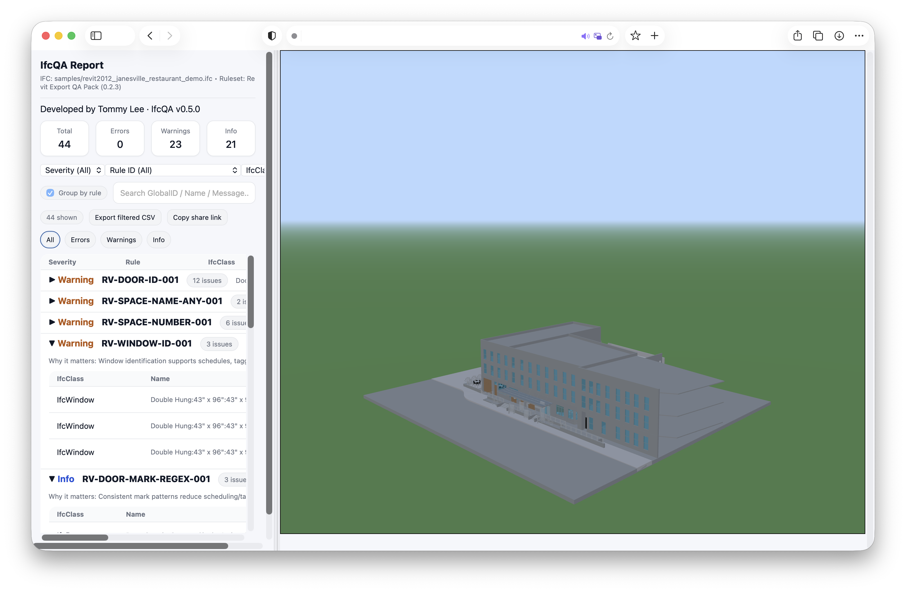

[](https://github.com/tommylee0923/ifc-quality-gate/actions/workflows/ifcqa.yml)

# IfcQA — IFC Quality Gate for BIM Pipelines



**IfcQA** is a lightweight **IFC quality-gate CLI** built with **C# / .NET / xBIM toolkit**. It validates BIM models against configurable rulesets and generates interactive HTML reports with 3D model viewer that links QA issues directly to the elements.

---

## Key Features

### Rule-based IFC QA Engine

- Modular C# rule system built on xBIM and JSON-driven rulesets
- Validates properties, naming, containment, and consistency
- Emits structured issues with severity + trace metadata
- Summary metrics + filterable issue table

### Interactive, Zero-Backend HTML QA Report

- Fully static HTML report (no server required)
- Embedded Three.js GLB viewer with preserved GlobalId mapping
- Issue ↔ Element synchronization
- Hover highlight, click selection, and detail drawer interaction
- Draggable split-pane UI for review workflows

### CLI-First, Automation-Friendly

- Deterministic and reproducible output
- `--fail-on` threshold support for CI gating
- Designed for local QA, model audits, and pipeline integration

---

## Architecture
### Backend (IFC Validation Engine)
- C# / .NET
- xBIM Toolkit

### IFC Model Processing
- IfcOpenShell (IfcConvert) — IFC → GLB export

### Frontend (Interactive QA Report)
- Three.js — GLB rendering & scene graph indexing
- Static HTML / CSS / JS (zero-backend distribution)

---

## Quickstart (Windows)

1)  Download and unzip the Windows release.
2)  Open Terminal in the extracted folder and run:
```powershell
# (Optional) initialize a local workspace (rulesets + report templates) and
# outputs in a folder named "Demo"
.\ifcqa.exe init -o Demo

# Run QA checks + generate interactive report (3D viewer enabled)
.\ifcqa.exe check PATH_TO_MODEL.ifc -o Demo\out --viewer
# (Optional) specify ruleset:
# .\ifcqa.exe check PATH_TO_MODEL.ifc -o Demo\out -r Demo\rulesets\PICK_A_RULESET_HERE --viewer
```
3)  Open Demo\out\report.html in your browser
    Outputs:
    - `report.html`
    - `report.json`
    - `issues.json`
    - `issues.csv`
    - `model.glb` - Generated when `--viewer` is enabled
    - `viewer` - Viewer assets copied from `Report/Templates/viewer`

---

## CI Quality Gate (GitHub Actions)

This repo includes a GitHub Actions workflow that runs IfcQA against a sample IFC on every push/PR and uploads the generated `report.html` as a build artifact.

---

## Project Structure

```
src/
├─ IfcQa.Core
│   ├─ Rules/ # Rule engine + validation logic
│   ├─ Models/ # Issue models + trace metadata
│   ├─ Analysis/ # IFC analysis orchestration
│   └─ IFC utilities/ # xBIM-based helpers
│
├─ IfcQa.Cli
│   ├─ Program.cs
│   ├─ HtmlReportWriter.cs
│   └─ Report/
│       └─ Templates/
│           ├─ report.template.html
│           ├─ report.css
│           ├─ report.js
│           └─ viewer/ # Three.js viewer assets
│               ├─ viewer.bundle.js
│               ├─ app.js
│               └─ modules/
│   
└─ rulesets/
```

---

## Status & Milestones

Active development.

- v0.4.0 — Static HTML QA report
- v0.5.0 — Interactive GLB viewer + UX improvement

Scoped to demonstrate **AEC software engineering**, **BIM reasoning**, and **production-quality tooling** without vendor lock-in.
